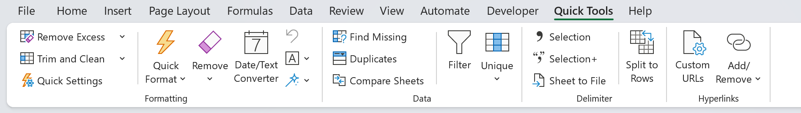
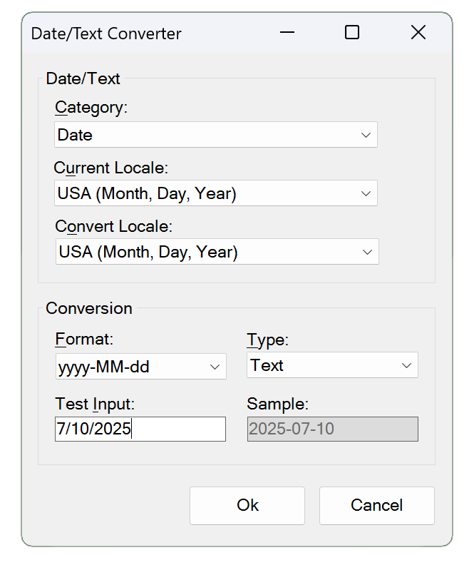
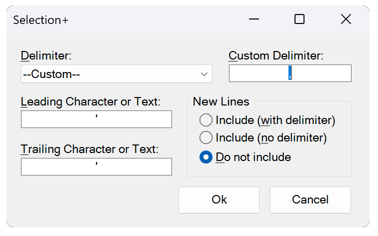
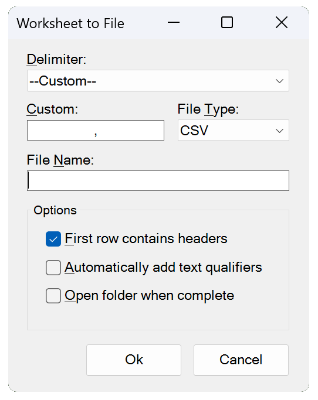

# XLQuickTools

An Excel VSTO Add-in featuring a collection of different tools.

### Table of Contents
- [How to Install](#how-to-install)
- Features
  - [Remove Excess Formatting](#remove-excess-formatting)
  - [Trim and Clean](#trim-and-clean)
  - [Quick Format Settings](#quick-format-settings)
  - [Quick Format](#quick-format)
  - [Date/Text Converter](#datetext-converter)
  - [Text Tools](#text-tools)
  - [Additional Formatting Tools](#additional-formatting-tools)
  - [Find Missing Data](#find-missing-data)
  - [Check for Duplicates](#check-for-duplicates)
  - [Compare Worksheets](#compare-worksheets)
  - [Unique Data Options](#unique-data-options)
  - [Copy Data to New Worksheets](#copy-data-to-new-worksheets)
  - [Selection/Selection+ to Clipboard](#selection)
  - [Create Delimited File](#worksheet-to-file)
  - [Split Columns to Rows](#split-columns-to-rows)
  - [Add/Remove Hyperlinks](#addremove-hyperlinks)

## Features

### **Remove Excess Formatting**
Delete unnecessary formatting from rows or columns that extend beyond the data in your worksheet. This helps reduce file size and improve performance by removing potentially thousands of blank, formatted rows.

### **Trim and Clean**
- Removes leading, trailing, and multiple spaces.
- Removes non-printable characters that can cause issues in your dataset.
- Can be applied to a selected range, active worksheet or workbook.

### **Quick Format Settings**
Configure and save your desired formatting preferences. These settings are applied when using the "Quick Format" button.

### **Quick Format**
Applies all formatting settings defined in **Quick Settings** to the active worksheet with a single click.

### **Remove Formatting**
Clears all formatting from the active worksheet, returning it to its default state.

### **Date/Text Converter**
Converts a selected range to a desired text or Excel format, allowing seamless switching between text-based dates, Excel dates, or other text and Excel formats. It can also convert between US Month, Day, Year and Day, Month, Year formats.

### **Undo**
Restores the range back to its original state. Excels Undo button will not work so this was added and works with the Date/Text Converter, Character Menu and Fill Down features.

### **Text Tools**
- **Upper Case:** Sets the selected range to all UPPER CASE.
- **Lower Case:** Sets the selected range to all lower case.
- **Proper Case:** Sets the selected range to all Proper Case.
- **Remove Letters:** Removes letters from text in the selected range.
- **Remove Numbers:** Removes numbers from text in the selected range.
- **Remove Special:** Removes special characters !@#$%^&*()_+ etc. from text in the selected range.
- **Normalize Text:** Normalize text/replace diacritics within the selected range. Déjà vu becomes Deja vu.
- **Replace Non-ASCII:** Replaces characters that fall outside the 128-character ASCII set with its HTML entity code.
- **Add Leading or Trailing:** Adds leading or trailing characters/text.
- **Subscript Chemical Formulas:** Sets numbers in text to subscript in the selected range. C6H12O6 becomes C₆H₁₂O₆.

### **Additional Formatting Tools**
- **Fill Down:** Fills blank cells with the value above, based on the selected range.
- **Delete Empty Rows:** Deletes any empty rows on the active worksheet.
- **Delete Empty Columns:** Deletes any empty columns on the active worksheet. This includes deleting columns with headings if the rest of the rows are empty.
- **Reset column:** Ensures the column's formatting and data handling are reset. Numbers stored as text will be recognized as numbers.

### **Find Missing Data**
Displays missing data between two selected ranges. This can be extended across multiple columns, worksheets or open workbooks. If you prefer to have the results on a new worksheet you can adjust the threshold.

### **Check for Duplicates**
Checks for duplicates in a selected column:
- If no duplicates are found, you'll be notified.
- If duplicates exist, a count column will be added to the right of the selected column.
- Toggle the count column On/Off with the column selected.

### **Compare Worksheets**
Compares two worksheets, even if they belong to different workbooks, provided both are open. Highlights any differences between the selected worksheets and provides a link to each difference. The refresh button clears the form and updates the dropdown lists if a new workbook has been opened. If you prefer to view the results on a new worksheet, you can adjust the threshold.

### **Filter**
The built-in Excel Filter button, placed on the Quick Tools tab for easier access while using other tools in the add-in.

### **Unique Data Options**
- **Selection Count:** Get the count of unique values and unique rows.
- **Selection to Clipboard:** Copy the selections unique data to clipboard.
- **Copy Data to New Worksheets:**

### **Copy Data to New Worksheets**
Copies data to new worksheets based on the unique values from a selected column.

### **Selection**
Comma-separates a selected range and stores the result in your clipboard.

### **Selection+**
Windows form version of **Selection** that:
- Allows leading and trailing characters.
- Allows new lines or removes the comma delimiter with new lines, which can be used for creating XML, HTML tags etc.

### **Worksheet to File**
Generates a delimited file from the active worksheet.

### **Split Columns to Rows**
Splits delimited columns into rows. It can handle columns with varying delimited lengths.

### **URL Settings**
Create and save parameterized URLs. Check "Active" to specify which URL will be applied when using the **Add/Remove** feature.

### **Add/Remove Hyperlinks**
Adds or removes hyperlinks on an entire column using a saved parameterized URL. Toggle this On/Off with the column selected.

&nbsp;

---

## How to Install

1. **Download the XLQuickTools ZIP File**  
   Click [here](https://github.com/lsementa/XLQuickTools/releases/tag/v1.0.0.2) to download the XLQuickTools installation package.

2. **Extract the Contents**  
   Locate the downloaded ZIP file, extract its contents, and open the folder.

3. **Run the Installer**  
   Double-click on `Setup.exe` to start the installation process.  
   > **Note**: If Microsoft Defender SmartScreen appears, click **More Info** and then **Run Anyway** to proceed.

4. **Verification**  
   This add-in is code-signed with an official certificate, and verified.

  

## How to Uninstall

1. **Open Add or Remove Programs**  
   On your Windows device, search for "Add or Remove Programs" in the Start menu.

2. **Find XLQuickTools**  
   Scroll through the list or search for **XLQuickTools**.

3. **Uninstall**  
   Select **XLQuickTools**, click **Uninstall**, and follow the prompts to remove the application.

  

  

